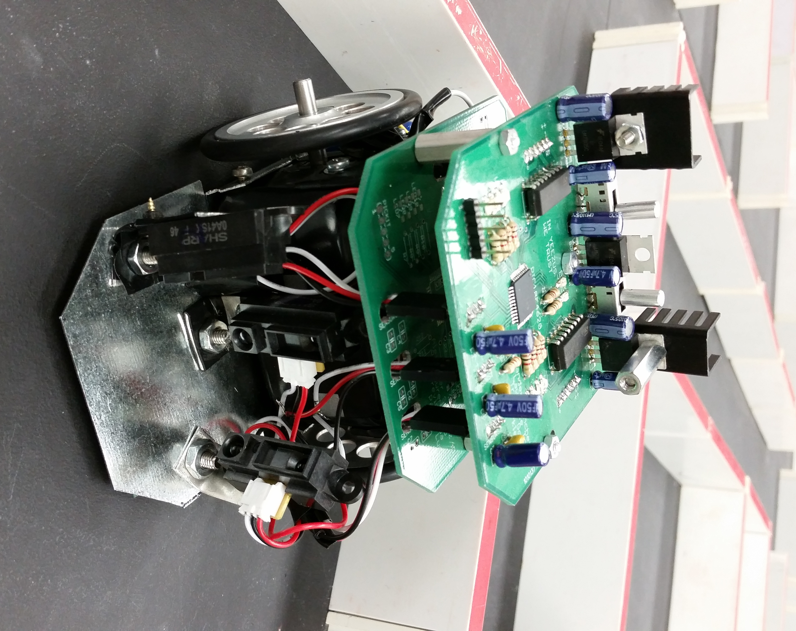
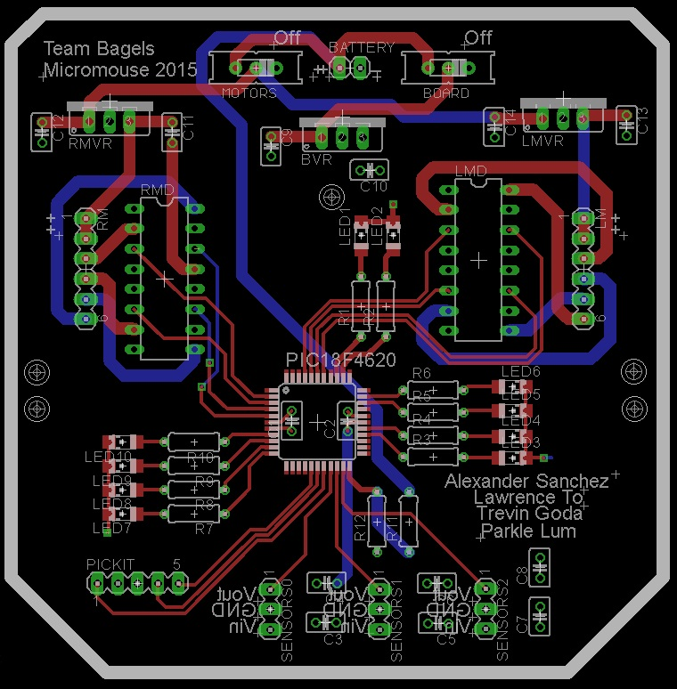

  
   

Micromouse is an event where small robot “mice” solve a 16 x 16 maze.  My team designed and built a small 'mouse' that could solve a prebuilt 16 x 16 maze autonomously. 

You can learn more at the [UH Micromouse Website](http://www-ee.eng.hawaii.edu/~mmouse/about.html).

