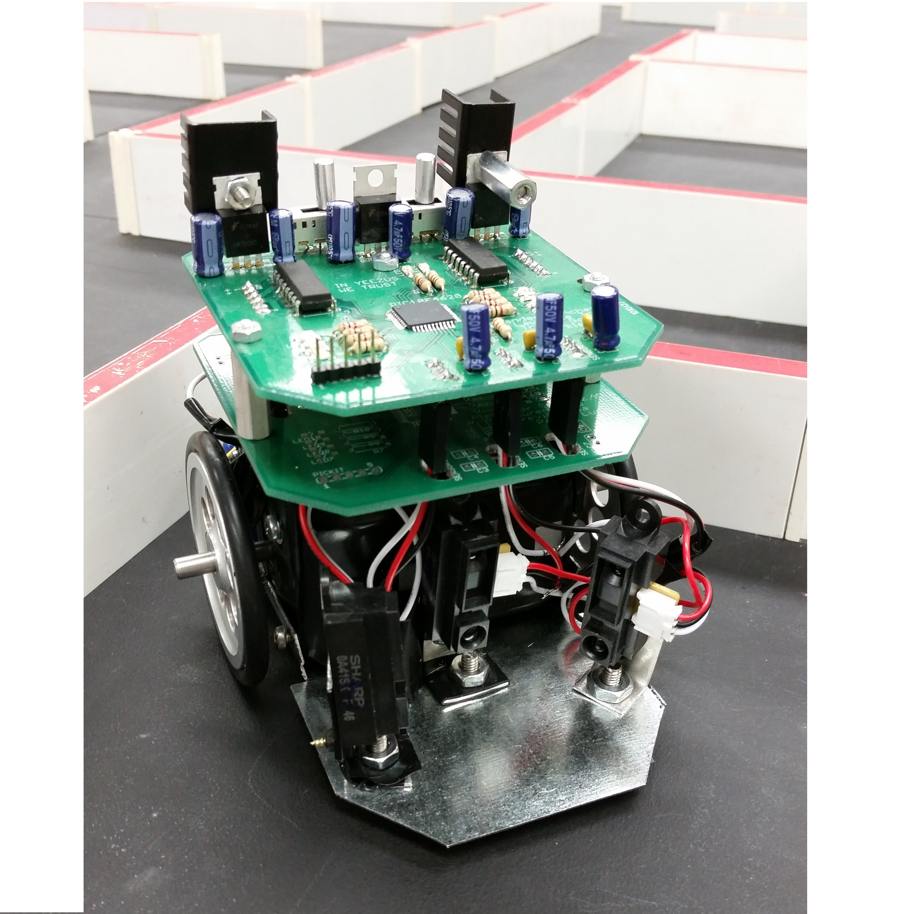

  
   
   
   
   

[Solved Maze (Video)](https://drive.google.com/file/d/0B3oLXv5IVIObTzNlUmdYRlhxdDA/view?usp=sharing)

[Final Report](https://drive.google.com/file/d/0B3oLXv5IVIObVnNRdXEyQjZNMTg/view?usp=sharing)

Micromouse is an event where small robot “mice” solve a 16 x 16 maze.  My team designed and built a small 'mouse' that could solve a prebuilt 16 x 16 maze autonomously. 

The goal of micromouse was always to make it to the center of the maze though there is learning along the way. We are doing this with a P controller that pushes from the walls to center itself and constantly track the walls for turns as well. It uses a right wall hugging algorithm to reach the center of the maze. The algorithm will give priority to right turns, give priority to straight always and then will give priority to left turns. We have debugged it a lot since there has been many problems with the turns and steps to get to the center without problems consistently. We also had help from the seniors when we had problems we did not understand.

Our team was composed of 4 members: Alex Sanchez, team lead and hardware lead, Lawrence To, designer and blogger, Trevin Goda, software lead, and Parkle Lum,  hardware and software. 

Alex possessed good leadership qualities. He provided emotional support and organized group meetings. He was strict but an efficient leader. Alex took initiative on the project and “motivated” the group to work. He decided to learn eagle to design a PCB. He created multiple versions of PCB and sent it to Bay Area circuits to have it fabricated. He oversaw all the hardware processes of our mouse and made helpful “suggestions” along the way.

Lawrence was a great asset to our team. He provided insightful blogs for other team members to read. He was there every step of the way and was very supportive of all decisions. He kept our parts organized and ensured we had all the parts we needed. When we didn’t have the part we needed he went out and got them. He was also the lead design for the chassis. Lawrence was in charge of creating the chassis. He did all the measurements and made sure the chassis would fit our PCB and motors. He went through the datasheets to make sure all our components would fit. He also helped attach the PCB to the chassis and acquired the necessary parts to complete the chassis.

Trevin was the lead software in our team. He encouraged the team to quickly finish hardware so he could program the mouse. At the very beginning he was learning how to program the mouse. He researched on interrupts and ADCs. He was very diligent throughout the project and was always reading datasheets for the configurations bits and ports. He began coding before the hardware was finished so he would have programs to test when mouse was actually built. Although hardware was behind schedule he was still with us, offering helpful suggestions and providing support. Trevin implemented the right wall hugging algorithm and wrote the entire code for the mouse. He had troubles with software but the team was able to help him out. Other veterans also helped us on our code. 

Parkle was responsible for helping on hardware and software. He was responsible for learning how to smd solder and helped with overall hardware and software problems. He learned how to use eagle and oversaw Alex’s design and made suggestions on the board. He did majority of the soldering especially the SMD components. He also created the sensor mounts for the sensors. He also assisted in the design of the overall chassis and “suggested” the double layered PCB design. Parkle helped with the algorithm of the mouse and offered assistance in software logic of the mouse.

You can learn more at the [UH Micromouse Website](http://www-ee.eng.hawaii.edu/~mmouse/about.html).

