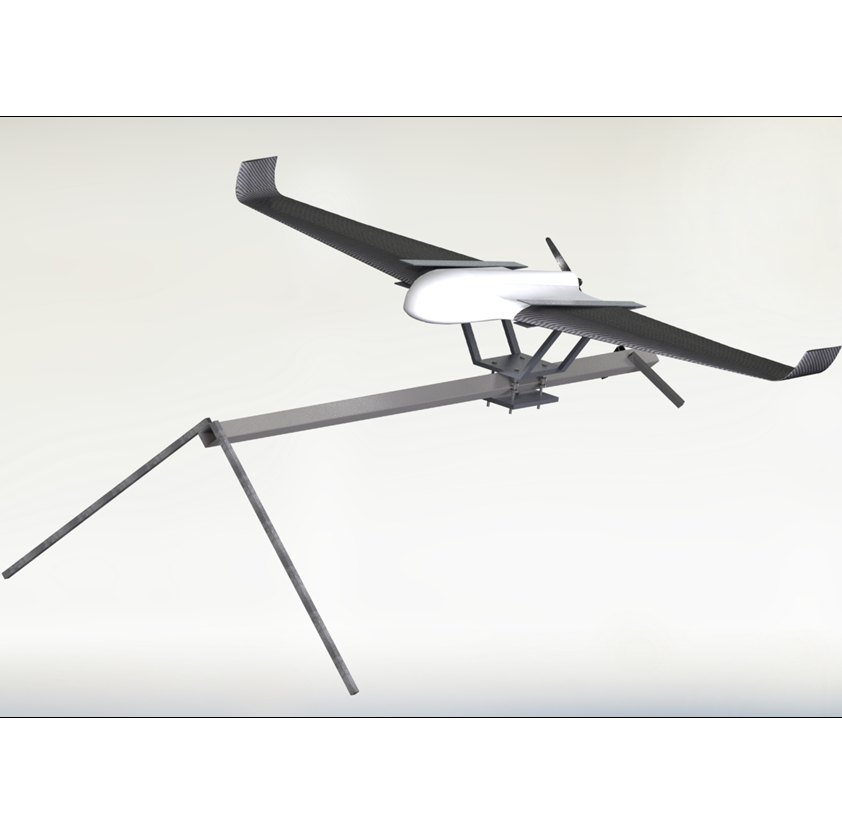
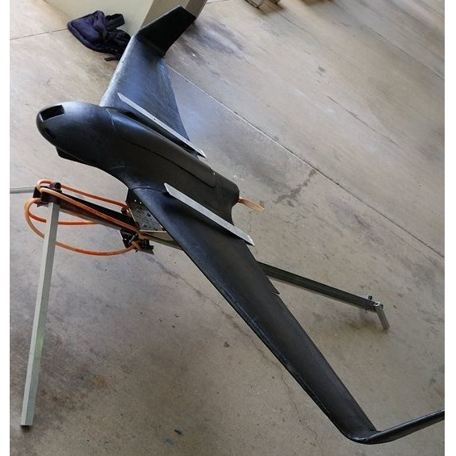

  
   
  

   The goal of this project was to design and build a fully autonomous electric Unmanned Aerial Vehicle (UAV) to survey and monitor a 4,000 acre macadamia nut farm on the Big Island of Hawaii. The UAV will take footage with an HD camera, so that the operator can determine if the crops are ready to harvest. 
    This blended body aircraft  has a lightweight EPO foam core reinforced with fiberglass and carbon epoxy composites.  It will be capable  of fully autonomous flight, following a GPS guided adjustable flight pattern, as well as manual RC control. The plane is also equipped with a real-time First Person View system and high definition surveillance camera under the fuselage. 

