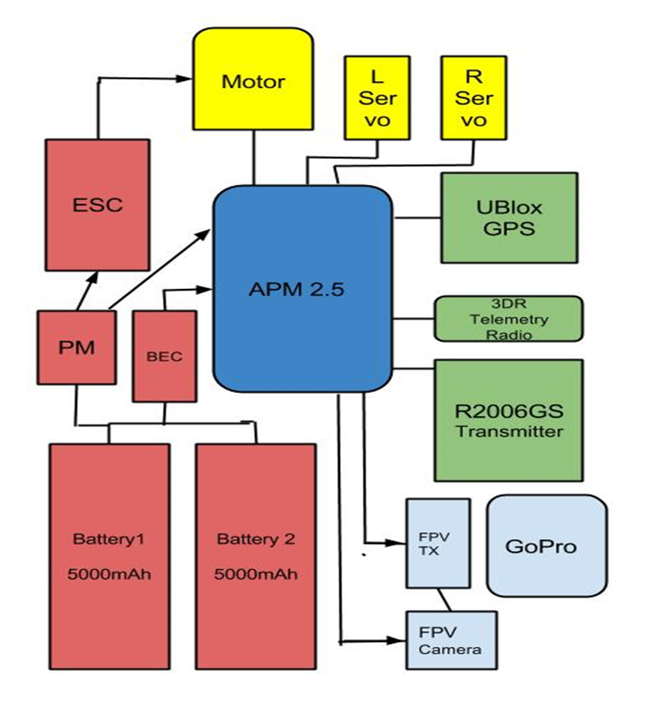

  
   
  

   The goal of this project was to design and build a fully autonomous electric Unmanned Aerial Vehicle (UAV) to survey and monitor a 4,000 acre macadamia nut farm on the Big Island of Hawaii. The UAV takes footage with an HD camera along with a live-feed First Person View camera, allowing the operator to determine if crops are ready to harvest. The UAV is capable of fully autonomous flight, following a GPS guided adjustable flight pattern. Responsibilities included: research and set up electronic components including: Li-Po batteries, Pixhawk flight controller, cameras, motors, and other electronic components to fit project specifications.

