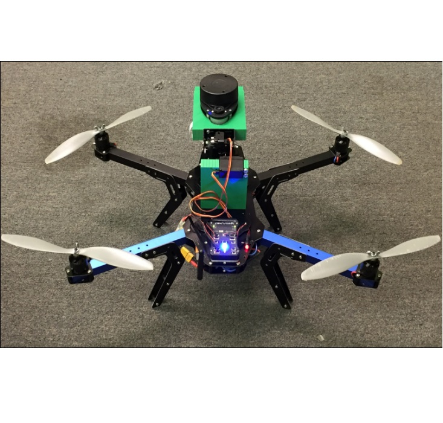
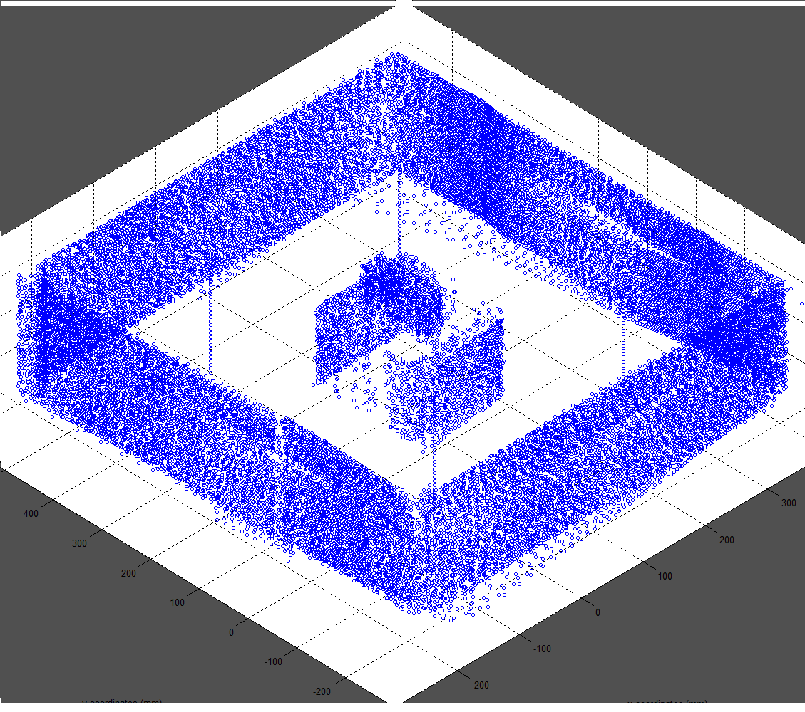

  
   

##Background:
In today’s society, the capabilities of Unmanned Aerial Vehicles can not be ignored. With their introduction into the commercial and hobby sector, the use of drones has expanded exponentially, finding many different uses in many different areas of society. One of these possible applications is three-dimensional mapping. With the use of a 3-D mapping system mounted on a drone, one would be able to capture accurate readings and images of different environments. The commercial applications of a 3-D mapping system mounted on a UAV are limitless. Take for instance, an environment that is too dangerous or too difficult for a person to enter. Using a UAV, one could enter the environment, take a scan of the area/room, and exit the area providing vital information about the environment. A 3-D mapping system mounted on a drone could also provide significant cost savings, reducing the cost of accessing an area that would normally be dangerous or hard to access for humans. Sending in a low cost UAV would reduce risk to human life, (insurance cost), remove the need to access difficult areas (transportation cost), and would greatly reduce the time and resources needed to take such measurements. A 3D mapping system mounted on a UAV would reduce risk, cost, and increase efficiency. 

##Introduction:
The goal of this project is to use a Pulsed Light LIDAR-Lite V1 along with an RPLIDAR 360° Laser scanner mounted on a quadcopter to 3D map on a small scale. Using both devices, along with a Raspberry Pi 2 to handle processing, we will be able to map different 3-Dimensional small-scale environments at low cost. This 3D mapping can possibly be expanded to allow for further applications in the future.

[Sensor Mount Gimbal](https://drive.google.com/file/d/0B3oLXv5IVIObdmQ5NHg3U2tUeUk/view?usp=sharing)

[Test Flight #1](https://drive.google.com/file/d/0B3oLXv5IVIObdHBnb0JPdk9Bb1E/view?usp=sharing)

[Final Report](https://docs.google.com/document/d/1GLAoFo-2xPzI_PE20Oi4psexXks5CJm9bCLDkA4hzZk/edit?usp=sharing)

