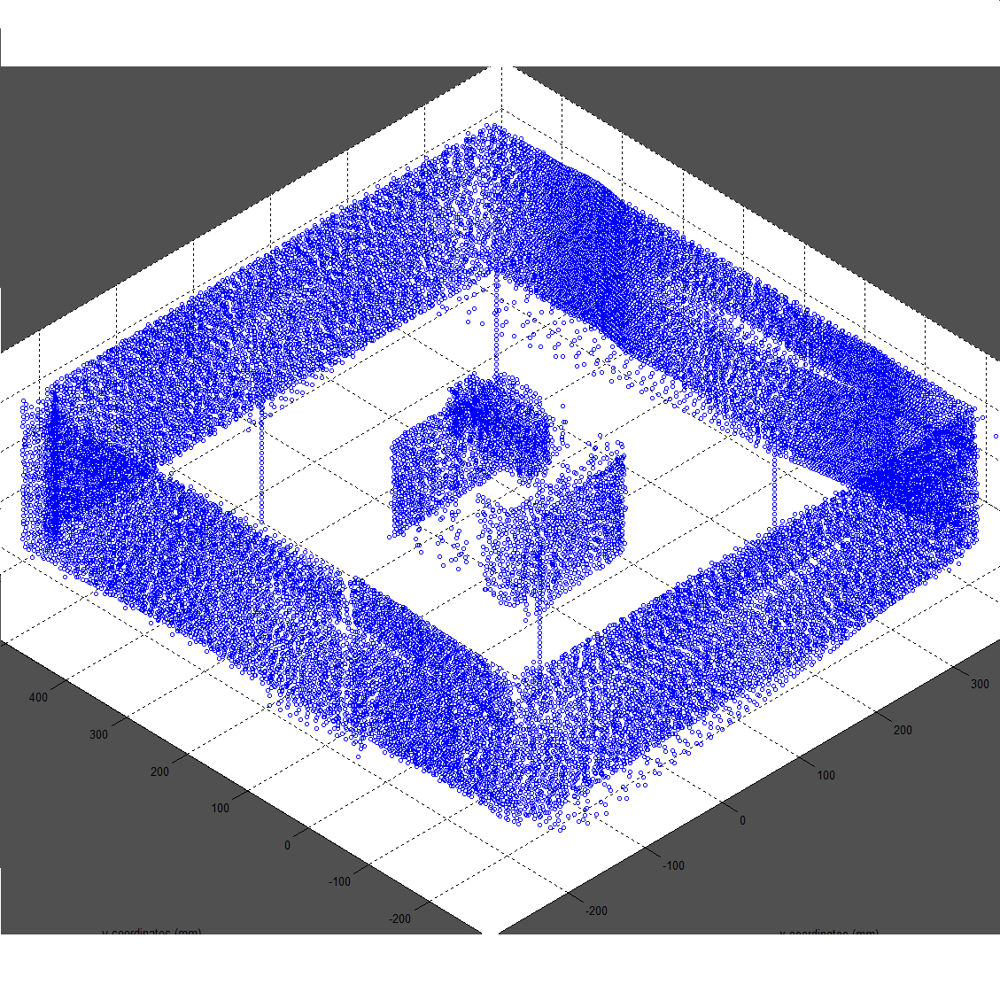

  
   

For my [EE496 Capstone project](http://www.ee.hawaii.edu/student/index.php?stc=1&stp=79) my lab partner and I helped develop software allowing an autonomous [unmanned aerial vehicle (UAV)](https://en.wikipedia.org/wiki/Unmanned_aerial_vehicle) to build static 3-Dimensional maps of small scale environments. 

## Background 

The commercial applications of a 3-D mapping system mounted on a UAV are limitless. Take for instance, an environment that is too dangerous or too difficult for a person to enter. Using a UAV, one could enter the environment, take a scan of the area/room, and exit the area providing vital information about the environment. A 3-D mapping system mounted on a drone could also provide significant cost savings, reducing the cost of accessing an area that would normally be dangerous or hard to access for humans. Sending in a low cost UAV would reduce risk to human life, remove the need to access difficult areas (transportation cost), and would greatly reduce the time and resources needed to take such measurements. A 3D mapping system mounted on a UAV would reduce risk, cost, and increase efficiency. 

In order to accomplish the task we utlized a modified 'out of the box' UAV, a [Pixhawk Flight Controller](https://pixhawk.org/), and a [SLAMTEC RPLIDAR 360degree Laser Scanner (Version 1)](https://www.slamtec.com/en).

## Initial Plan
The 360 Laser scanner was supplied with 2-dimensional mapping software (demoed above). My partner and I came up with the idea, to strap the 360laser scanner on the UAV which would then fly to designated 'control points.' Once at the control point, the laser scanner would scan the room at its current location, and record its location. Once the UAV had taken an acceptable amount of scans of a room, our software would take each scan, along with its coordinates and accomodate the different scan locations by taking into account the coordinates of each scan location. Doing this, we could effectively 'stitch' each different static 2-dimensional map, into one 3-dimensional map. 

## Basic Algorithm for Mapping Points
1. Take 2D scans using 360° scanner
2. Store coordinates for the origin of each scan. (Δx, Δy, Δz)
    These origins will be used to offset coordinates
3. Offset each point by the origin corresponding to the scan
    (x + Δx, y + Δy, z + Δz) for each point
4. Assemble 3D map from points using algorithm below

## Basic Algorithm for Generating 3D Map from Points
1. Sort data from scans by type (x, y, z). 
2. Use MATLAB to read and plot x,y,z coordinates.
3. Scatter plot used to generate 3D map.

## Results
My partner and I were able to create 3-dimensional maps with manually inputted coordinates for the 'control points.' 

Figure 1. UAV with 2-d scanner mounted on stabilization platform (3D printed mounts on gimbal.)

Figure 2. 3-dimensional map of small box on bigger box in room.
The inconsistencies found are due to the small inconsistencies with the given scan location coordinates. This software would need an additional correction algorithm before being deployed. 

[Poster Board for Final Presentation](https://docs.google.com/presentation/d/1E7QgWdOTH9bBuWeAJh5SnWRyPhcc544njnLw52QVCds/edit?usp=sharing)

