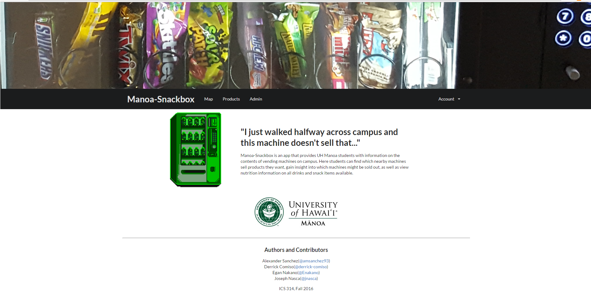

  

Manoa Snackbox is a web application that I helped create as a final team project in [ICS314](http://www.catalog.hawaii.edu/courses/departments/ics.htm), Software Engineering, Fall 2016. The project helped my team and I learn how to design and implement a responsive website. 

To implement Manoa Snackbox we used [Meteor](https://www.meteor.com/), 'an open source platform for web, mobile, and desktop.' 

This application allows users to find out information on the different vending machines located across the University of Hawaii campus, including inventory lists, and nutritional information on the products carried. 

With this project, I gained 'hands-on' experience with full-stack web application design, including [MongoDB](https://www.mongodb.com/) to implement the database, CSS, and Jacascript for client and server-side programming. 

[Organization GitHub Page](https://manoa-snackbox.github.io/)

Source: <a href="https://github.com/manoa-snackbox/manoa-snackbox"><i class="large github icon"></i>manoa-snackbox/manoa-snackbox</a>

