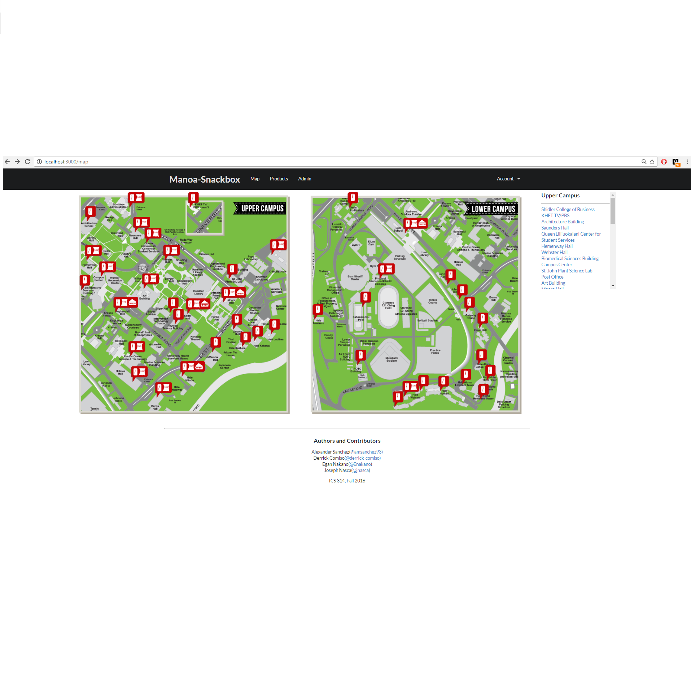
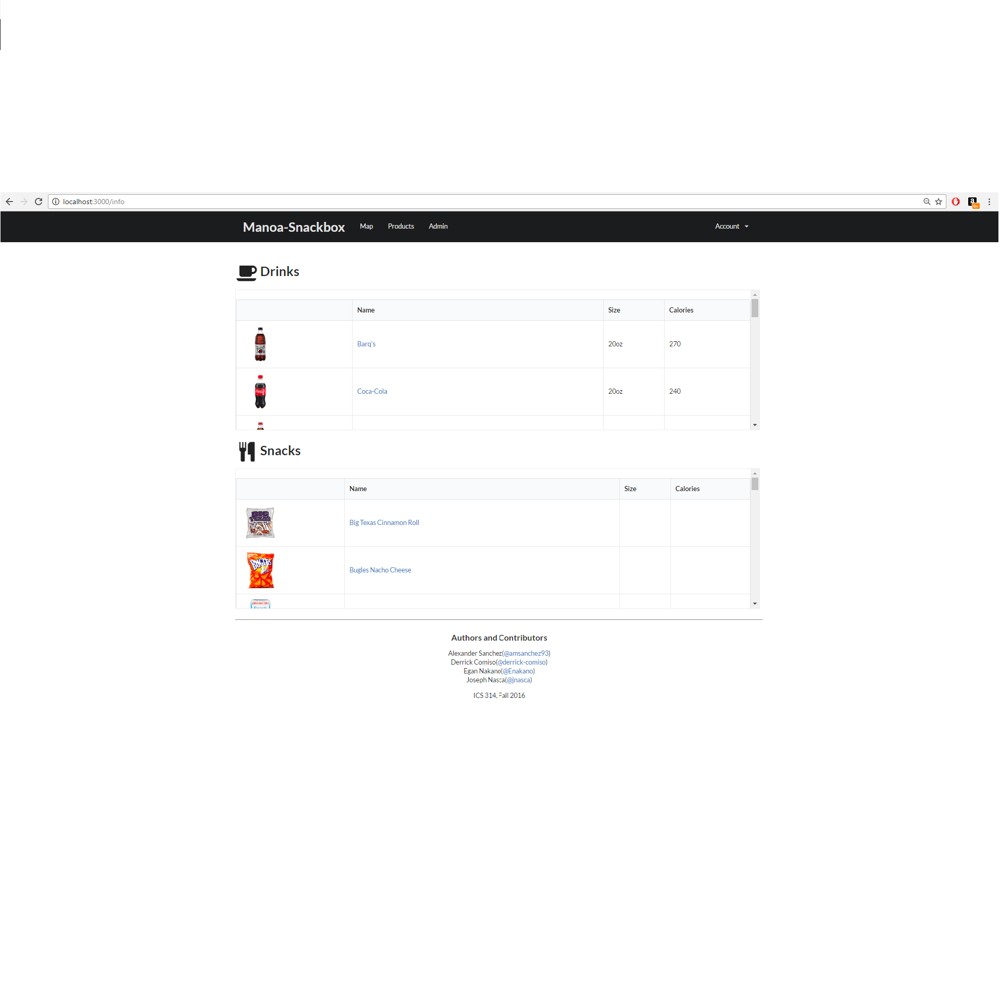

  
   
   

[Organization GitHub Page](https://manoa-snackbox.github.io/)

Manoa Snackbox is an app that provides UH Manoa students with information on the contents of vending machines on campus.
Here students can find which nearby machines sell products they want, gain insight into which machines might be sold out, as well as view nutrition information on all drinks and snack items available.

