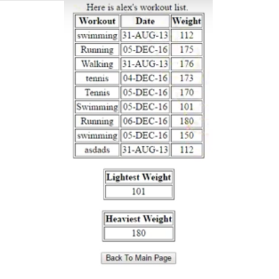

  
   
  

'Simple Workout Tracker' is a simple DBMS backed web application that I created for my final project in [ICS321](http://www.catalog.hawaii.edu/courses/departments/ics.htm), Data Storage & Retrieval, Fall 2016. The project helped me learn how to design and implement an application backed by a DBMS. 

For this project, I used multiple HTML pages to allow users to enter their username, password, and workout information. Using PHP and  and MySQL, I was able to allow users, once verified, to read and write data to their profiles. 

With this project, I gained 'hands-on' experience with DBMS driven web application design.

I received a perfect score on this project. 

[Application Demo (Video)](https://youtu.be/Y55aI77Opms)

